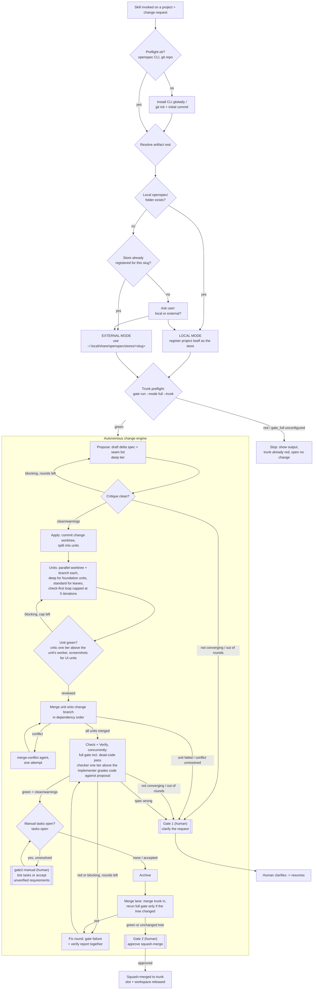

# openspec-orchestrator


A [Claude Code](https://claude.com/claude-code) skill for spec-driven development on top
of [OpenSpec](https://github.com/Fission-AI/OpenSpec): draft a delta spec, critique it,
implement it, gate and verify it, archive it into the living spec. Execution is
autonomous end to end, with two defined human checkpoints.

This repository is the engine, not a target project. Everything a consumer installs lives
under `skills/openspec-orchestrator/`; the rest of the repo is tests, design records and
this repository's own OpenSpec scaffold. It is applied, by the skill, to whichever project it is invoked on.

## Overview

- **Discipline.** No application code changes before a delta spec proposal exists and has
  passed critique. Implementation maps 1:1 to the finalized proposal, tests land with it,
  and a full gate — including a dead-code pass — runs before anything is archived.
- **Routing.** Determines where OpenSpec artifacts (proposals, specs, tasks) live for a
  given project:
  - a project with a local `openspec/` folder uses it (**local mode**);
  - a project with neither a local folder nor a registered store gets an **external
    store** under `~/.local/share/openspec/stores/<slug>/`, leaving the project's directory and git
    history untouched by OpenSpec;
  - a project with neither is asked once, at first invocation.

  Local mode takes priority over an existing external store for the same project. See
  [SKILL.md § Step 1](skills/openspec-orchestrator/SKILL.md).
- **Execution.** Autonomous: Propose → Apply → Check → Verify → Archive → Merge, end to
  end, with at most two mandatory human checkpoints per change (Gate 1, Gate 2 — Gate 0's
  acceptance is required too but is part of every round, not a conditional checkpoint),
  plus a manual task check before Archive whenever the change left tasks unverified (see
  flowchart). There is no step-by-step mode.

## Architecture



## Repository layout

| Path | Contents |
|---|---|
| [`skills/openspec-orchestrator/`](skills/openspec-orchestrator/) | The installable skill: everything below this row ships to a consumer as one directory. |
| [`SKILL.md`](skills/openspec-orchestrator/SKILL.md) | Skill definition: preflight, root resolution, the 3-phase workflow, guardrails. |
| [`AUTONOMOUS-ORCHESTRATION.md`](skills/openspec-orchestrator/AUTONOMOUS-ORCHESTRATION.md) | Operational rules for the autonomous run: phases, slots, units, checker loops, model/effort routing, bug triage, initiatives. |
| [`scripts/run-change`](skills/openspec-orchestrator/scripts/run-change) | Mechanical engine: slots, workspaces/worktrees, gates, merge lane, state and session-log bookkeeping. |
| [`scripts/lib.sh`](skills/openspec-orchestrator/scripts/lib.sh) | Shared helpers: store/registry lookups, state-file format, model routing, project-skill stage mapping, local-vs-external guard. |
| [`scripts/roles/`](skills/openspec-orchestrator/scripts/roles/) | Literal dispatch text per engine role (proposer, critic, worker, unit-critic, verifier). |
| [`CONTEXT.md`](skills/openspec-orchestrator/CONTEXT.md) | Domain glossary: Store, Change, Worker, Advisor, Blackboard, Seam list, etc. |
| [`releases.json`](skills/openspec-orchestrator/releases.json) | Version history read by Atlas; written by `atlas bump`, never by hand. |
| [`tests/run.sh`](tests/run.sh) | Black-box tests for `run-change`, via its CLI only. Not installed. |
| [`docs/proposals/`](docs/proposals/) | Design records for engine extensions. Adopted proposals reference where they landed; others are marked as sketches. |
| `openspec/`, `.openspec-store/` | This repository's own OpenSpec scaffold, used to develop the skill under its own discipline. Not required by a target project. |

## Installation

### Prerequisites

- [Claude Code](https://claude.com/claude-code).
- The `openspec` CLI on `PATH`: `npm i -g openspec`. The skill installs/upgrades this
  globally when missing; never as a project dependency.
- A target project must be a git repository. If it isn't, the skill runs `git init` and an
  initial commit before proceeding.

### Install the skill

The skill is the directory `skills/openspec-orchestrator/`. `SKILL.md` and
`AUTONOMOUS-ORCHESTRATION.md` invoke `scripts/run-change` relative to that directory and
`scripts/lib.sh` locates its siblings the same way, so the directory must land whole
wherever Claude Code loads skills from. Without Atlas:

```bash
cp -R skills/openspec-orchestrator ~/.claude/skills/openspec-orchestrator
```

A symlink to that directory works for development and tracks `git pull`, but hides the
install path a consumer gets; prefer the copy when testing a release.

### Install via Atlas

This repository is also a single-skill [Atlas](https://atlas.docs.paramount.tech/) catalog
(`atlas-catalog.json` at the repo root), the same distribution mechanism used by
[`architectural-agentic-skills`](https://github.com/paramount-streaming/architectural-agentic-skills).
With the [Atlas CLI](https://atlas.docs.paramount.tech/) installed (`npm i -g @paramount/atlas-cli`),
add this repo as a catalog and install the skill:

```bash
atlas add-catalog https://github.com/soarea-viacom/openspec-orchestrator.git
atlas install-skill openspec-orchestrator
```

Future releases are picked up with `atlas update-skill openspec-orchestrator`, and
`atlas versions-skill openspec-orchestrator` lists available versions. This is an
alternative to the symlink/clone install above, not a replacement — either works.

### Preparing a target project

Before running the skill on a project for the first time, check the things the engine
depends on but cannot fix for you:

- **Gate runtime.** The full gate runs once per Check and again in the merge lane when
  the tree changed. Measure how long it takes and whether the test runner parallelizes.
  Parallelize it once shared-state tests are confirmed safe, pinning the ones that are not
  to serial rather than dropping parallelism everywhere.
- **Quick gate.** Have a cheap lint / type-check / last-failed-tests command available for
  `gate_quick` — keep it under ~30 s; anything slower (the full suite, the dead-code pass)
  belongs in `gate_full` (see Configuration).
- **Workspace cost.** Each change gets its own git worktree under the store's
  `.orchestration/workspaces/` (the engine adds the ignore rule itself). Confirm
  dependencies can be installed or linked into a fresh worktree cheaply, and that
  validation scripts do not assume real directories where a symlink may appear (`find -H`).
- **Protected paths.** Note any tree that must never be modified (generated-and-committed
  files, secrets, fixture inputs) so the proposal can state it as a constraint.
- **Existing approval policy.** If the repository already gates commits, merges or pushes,
  make sure Gate 2 does not duplicate it. Optionally enforce Gate 2 deterministically with
  a pre-execution hook that intercepts commit/merge/push on the main checkout's trunk and
  requires approval, while allowing everything rooted under the workspace directory.

## Usage

Invoke from inside, or pointed at, a target project:

```
/openspec-orchestrator add rate limiting to the /login endpoint
```

For read-only discovery with no artifacts written:

```
/sdd:explore how should we approach rate limiting?
```

### Execution sequence

1. **Routing** — resolves local mode, external-store mode, or prompts once. Recomputed
   from repo state on every invocation; not cached. See [SKILL.md § Step 1](skills/openspec-orchestrator/SKILL.md).
2. **Trunk preflight** — before any change opens: `gate run --mode full --trunk` runs
   `gate_full` against the trunk ref in a temporary worktree. Red, or `gate_full`
   unconfigured, stops here; no change is opened and no state is written.
3. **Autonomous run** — Propose (with critique) → Apply (split into units, each in its own
   worktree/branch with a check-first loop capped at 5 iterations — `deep` for a unit others
   depend on, `standard` for a leaf — reviewed by a critic one tier above its own worker,
   merged in dependency order) → Check + Verify (concurrent) →
   Archive → Merge lane, with fix rounds and tier escalation handled automatically. No
   approval between phases. `parallel: false` runs the change as one unit instead, a
   single-worker baseline. The merge lane reruns the full gate only when merging trunk
   changed the tree the gate already passed on.
4. **Manual task check** (conditional, before Archive) — if the change's tasks.md still
   has unchecked tasks when Verify and the full gate pass, action `gate2-manual` shows the
   human the open task list alongside the verify report; they tick tasks off or record
   which unverified requirements to accept. Archive runs only once that is resolved.
5. **Gate 1** (conditional) — raised if critique or Verify cannot converge, or the request
   is ambiguous. Requires clarification before the change resumes.
6. **Gate 2** (once, at completion) — diffstat, gate log, verify report, and any
   accepted-unverified requirements presented for squash-merge approval.

A request scoped to a single phase (e.g. "just draft the proposal") is still treated as
the full change; there is no partial-run mode. Stopping early leaves the change `blocked`.

### Local vs. external mode

| | Local mode | External mode |
|---|---|---|
| Applies when | Project has (or the user chose) `openspec/` in the project | Project has neither, or a store is already registered |
| Artifact location | `<project>/openspec/` | `~/.local/share/openspec/stores/<slug>/openspec/` |
| Project git history | Includes artifacts | Untouched by OpenSpec |
| Registration | Project registered as the store (`openspec store setup <slug> --path <project> --no-init-git`) | Separate directory registered as the store, with its own git history |
| Config location | `<project>/openspec/config.yaml` | `~/.local/share/openspec/stores/<slug>/openspec/config.yaml` |

`openspec store remove` must not be run on a local-mode store: its `local_path` is the
project root, and `--yes` deletes project files.

### Configuration

Orchestration settings live only in the resolved root's `openspec/config.yaml`:

```yaml
orchestration:
  concurrency: 2                     # max concurrent changes for this project (default 2)
  unit_concurrency: 3                # max concurrent units within one change (default 3)
  parallel: true                     # false runs each change as one unit (single-worker baseline)
  gate_quick: "npm run lint && npm run typecheck"
  gate_full: "npm test && npx knip"  # must include a dead-code pass
  model_mechanical: claude-haiku-4-5-20251001   # optional overrides
  model_standard: claude-sonnet-5
  model_deep: claude-opus-5
  model_max: claude-fable-5-1        # checker tier for deep-tier work
  stage_skills:                      # optional — route to the project's own skills
    plan: project-spec-drafter       # replaces the default drafter
    critic: [project-code-review]    # runs in addition to the default checker
    test: [project-test-skill]       # runs in addition to the default checker
```

`model_*` are optional; unset tiers fall back to the default tier→model table
(`scripts/run-change model get`). `unit_concurrency` and `parallel` are optional too —
`concurrency` defaults to 2, `unit_concurrency` to 3, and `parallel` to `true`; a change's
own `parallel` state field overrides the store default. `stage_skills` is optional: `plan`
accepts at most one skill and replaces the deep-tier drafter when set; `critic`/`test`
accept a list and stack on top of the built-in checker. See
[`docs/proposals/skill-stage-mapping.md`](docs/proposals/skill-stage-mapping.md).

### Tests

```bash
bash tests/run.sh
```

Exercises `skills/openspec-orchestrator/scripts/run-change` against a temporary registry and git origin/clone: slots,
workspaces, gates, merge lane, the local-vs-external guard, `stage-skills get`, and state
transitions. All three scripts must also pass `bash -n`.

## Guardrails

- `openspec init` is never run in a target project, in either mode.
- No writes under a project root beyond OpenSpec artifacts, `.openspec-store/store.yaml`
  (local mode), and a `git init` plus initial commit when missing.
- Local mode takes priority over an existing external store for the same project; the
  bypassed store is left untouched.
- Every OpenSpec CLI call carries `--store <slug>` once a root is resolved.

Full list: [SKILL.md § Guardrails](skills/openspec-orchestrator/SKILL.md).
